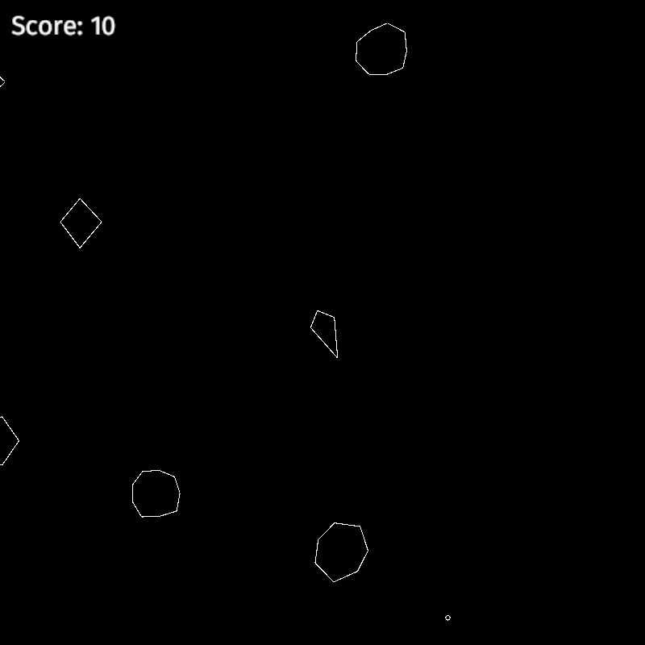
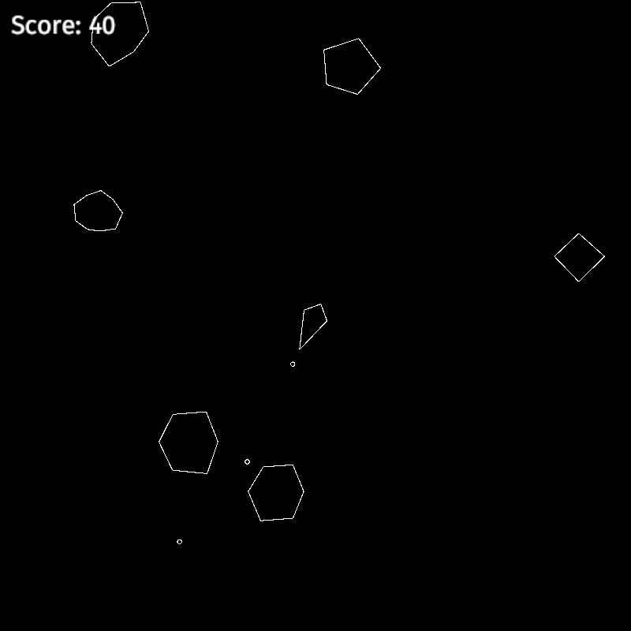

## Asteroids clone made in Rust

### Running
`$ git clone https://github.com/nicey0/asteroids-clone.git`

`$ cd asteroids-clone`

`$ cargo run`

### Installation
No

### Files
- asteroid.rs
    - Asteroid structure
- col.rs
    - Collision logic
- consts.rs
    - Constant stuff
- main.rs
    - Driver code
- math.rs
    - Math stuff
- render.rs
    - Rendering stuff
- ship.rs
    - Ship and bullet structures
- update.rs
    - Updating stuff
- util.rs
    - Utility stuff (State enum, Point type, ...)

### Screenshots

